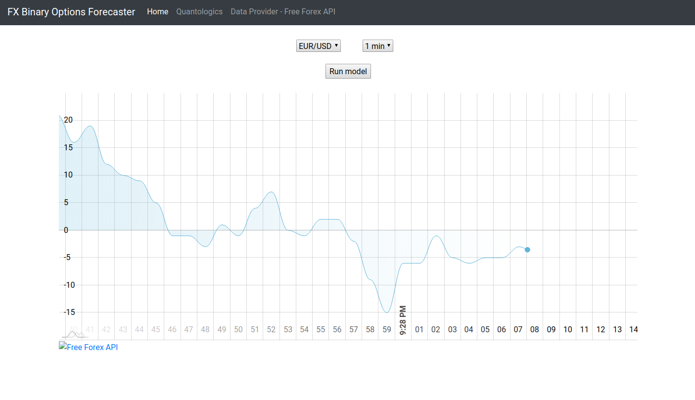

# FX Binary Options Forecaster - Under Development!

The project is currently under development, and it will be updated every 2-3 days with new features.
The idea of this project is to predict whether the price of a currency pair will be higher or below the current tick after a specified period. There will be a publicly available dummy machine learning model predicting the outcome. You will be able to put your own models or use my more accurate models (above 60% accuracy) as a service. 
Currently, the project is at an early stage and generates random numbers to simulate price drift seen in the photo below. 
Next steps are as follows:
* finish the front-end
* connect to Free Forex API
* add modules for training and predicitng

## Running intructions

### General Start-Up:

type in the console: `python app.py`

### Running by Virtual Environment (Windows):

`pip install virtualenv`

`virtualenv myenv` or `python -m venv myenv`

`start myenv\Scripts\activate.bat`

`pip install -r requirements.txt`

`python app.py`

### Running by Virtual Environment - Linux or MacOS:

`pip install virtualenv`

`virtualenv myenv` or `python -m venv myenv`

`source myenv/bin/activate`

`pip install -r requirements.txt`

`python app.py`
